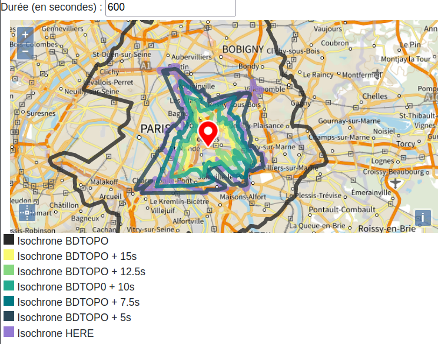

# Amélioration des vitesses dans Road2

_Road2_ est le moteur de calcul d'itinéraire développé par l'IGN utilisé par le service d'itinéraire et d'isochrone `V2` du Géoportail. Plutôt qu'un moteur en tant que tel, il s'agit plutôt d'un _proxy de moteurs_ dans la mesure où les calculs d'itinérraires et d'isochrones sont fait par d'autre moteurs open source, auxquels _Road2_ fait appel. En l'occurence, les moteurs actuellement implémentés sur la plateforme sont `OSRM`, un moteur extrêmeent performant au prix d'une configurabilité très limitée, et `pgRouting`, un moteur basé sur la technologie de base de données `PostgreSQL` qui permet à l'utilisateur faisant la requête de paramétrer cette dernière avec un haut niveau de personnalisation, au prix de la performance.

Les données utilisées pour générer les graphes routiers utilisés par les _backends_ de _Road2_ sont issues de la BDTopo, et plus précisément de 2 tables du thème transport : `troncon_de_route` et `non_communications`. Les vitesses utilisées dans le calcul d'itinéraire pour les voitures sont celles présent dans le champ `vitesse_moyenne_vl` de la table `troncon_de_route`.

## Situation actuelle des vitesses dans Road2

Dans le déploiement actuel de Road2, les temps de trajets sur les tronçons sont calculés en utilisant uniquement la vitesse de la BDTopo et la longueur du tronçon. Ce mode de fonctionnement pose un problème, notamment en milieu urbain : les temps de trajet sont très largement sous-estimés. Ce problème a notamment été remonté par Matthieu Le Masson dans le cadre de son travail sur le projet NexSIS, qui nécessite d'avoir des temps de trajets réalistes pour les services de sécurité.

### Constat : les vitesses sont trop élevées en ville

Afin de se rendre compte du problème et de son étendue, j'ai réalisé des interfaces de comparaison des itinéraires renvoyés par Road2 aujourd'hui (en noir) et ceux de différents services du marché (notamment HERE, qui est utilisé par beaucoup partenaires du projet NexSIS actuellement). Quelques résultats ci-après :

> Toutes les captures d'écran ont été prises en se servant d'un outil de visualisation global que j'ai développé, et dont je donne le lien à la fin du texte, dans la sous-partie [Modification-des-vitesses-et-prise-en-compte-des-intersections](###Modification-des-vitesses-et-prise-en-compte-des-intersections). J'ai modifié son code source pour proposer les captures d'écran avec un sous-ensemble des moteurs comparés.

> Comparaison des itinéraires de Road2 et de différents services disponibles en milieu urbain

> Comparaison des itinéraires de Road2 et de différents services disponibles en milieu non urbain

On constate qu'en milieu urbain, le temps estimé est souvent de l'ordre de 60% du temps estimé par les services du marché, ce qui présente une différence très significative. De plus, les tracés proposés par Road2 sont souvent assez différents de ceux proposés par les autres services, et n'évitent pas systématiquement les "petites routes" aux nombreuses intersections.

En milieu "rural" (non dense), les itinéraires de Road2 sont beaucoup plus similaires à ceux des services du marchés, y compris sur le temps de parcours.

Afin de bien se rendre compte de manière géographique de la différence entre Road2 et HERE, j'ai réalisé un interface qui compare les isochrones renvoyées par les 2 services :

> Comparaison des isochrones de Road2 et de HERE en milieu urbain

> Comparaison des isochrones de Road2 et de HERE en milieu non urbain

Encore une fois, en milieu dense, Road2 est beaucoup plus "optimiste" que HERE : pour un même temps de parcours, Road2 va parfois presque deux fois plus loin que HERE !

En milieu non dense, les isochrones renvoyées par les deux services sont très similaires, et leurs limites sont très proches.

À partir de ce constat, nous avons concentré nos efforts sur les milieux urbain, denses, et je ne présenterai des exemples que dans ce type de milieu à partir de maintenant.

### Origine du problème

#### Vitesses des tronçons ?

Au départ, le postulat était que les vitesses renseignées dans la BDTopo ne correspondaient pas à la réalité. En effet, le calcul de l'attribut `vitesse_moyenne_vl` suit des règles assez particulières qui ne semblent pas de prime abord pouvoir se conformer à chaque cas particulier, et à la vitesse moyenne constatée.

> Règles de calcul :
>
> Hors zone urbaine ('Urbain'="Faux") :
>
> Nature = ‘Type autoroutier’ avec classement admin. en autoroute & Importance = ‘1’ –> 125 km/h  
> Nature = ‘Type autoroutier’ avec classement admin. en autoroute & Importance = ‘2’ –> 115 km/h  
> Nature = ‘Type autoroutier’ avec classement admin. en autoroute & Importance = ‘3’ –> 100 km/h  
> Nature = ‘Type autoroutier’ non classée comme autoroute & Importance = ‘1’ –> 105 km/h  
> Nature = ‘Type autoroutier’ non classée comme autoroute & Importance = ‘2’ –> 100 km/h  
> Nature = ‘Type autoroutier’ non classée comme autoroute & Importance = ‘3’ –> 95 km/h  
> Nature = ‘Type autoroutier’ non classée comme autoroute & Importance = ‘4’ –> 90 km/h  
> Nature = ‘Type autoroutier’ non classée comme autoroute & Importance = ‘5’ –> 90 km/h  
> Nature = ‘Route à 1 chaussée’ & Importance = ‘1’ –> 67 km/h  
> Nature = ‘Route à 1 chaussée’ & Importance = ‘2’ –> 67 km/h  
> Nature = ‘Route à 1 chaussée’ & Importance = ‘3’ –> 63 km/h  
> Nature = ‘Route à 1 chaussée’ & Importance = ‘4’ –> 58 km/h  
> Nature = ‘Route à 1 chaussée’ & Importance = ‘5’ –> 35 km/h  
> Nature = ‘Route à 2 chaussées’ & Importance = ‘1’ –> 80 km/h  
> Nature = ‘Route à 2 chaussées’ & Importance = ‘2’ –> 75 km/h  
> Nature = ‘Route à 2 chaussées’ & Importance = ‘3’ –> 67 km/h  
> Nature = ‘Route à 2 chaussées’ & Importance = ‘4’ –> 67 km/h  
> Nature = ‘Route à 2 chaussées’ & Importance = ‘5’ –> 65 km/h  
> Nature = ‘Route empierrée’ -> 10km/h  
> Nature = ‘Rond-Point’ -> 25 km/h  
>
> En zone urbaine ('Urbain'="Vrai") :
>
> Nature = ‘Type autoroutier’ avec classement admin. en autoroute & Importance = ‘1’ –> 100 km/h  
> Nature = ‘Type autoroutier’ avec classement admin. en autoroute & Importance = ‘2’ –> 95 km/h  
> Nature = ‘Type autoroutier’ avec classement admin. en autoroute & Importance = ‘3’ –> 90 km/h  
> Nature = ‘Type autoroutier’ non classée comme autoroute & Importance = ‘1’ –> 95 km/h  
> Nature = ‘Type autoroutier’ non classée comme autoroute & Importance = ‘2’ –> 90 km/h  
> Nature = ‘Type autoroutier’ non classée comme autoroute & Importance = ‘3’ –> 85 km/h  
> Nature = ‘Type autoroutier’ non classée comme autoroute & Importance = ‘4’ –> 67 km/h  
> Nature = ‘Type autoroutier’ non classée comme autoroute & Importance = ‘5’ –> 67 km/h  
> Nature = ‘Route à 1 chaussée’ & Importance = ‘1’ –> 50 km/h  
> Nature = ‘Route à 1 chaussée’ & Importance = ‘2’ –> 50 km/h  
> Nature = ‘Route à 1 chaussée’ & Importance = ‘3’ –> 45 km/h  
> Nature = ‘Route à 1 chaussée’ & Importance = ‘4’ –> 40 km/h  
> Nature = ‘Route à 1 chaussée’ & Importance = ‘5’ –> 30 km/h  
> Nature = ‘Route à 2 chaussées’ & Importance = ‘1’ –> 50 km/h  
> Nature = ‘Route à 2 chaussées’ & Importance = ‘2’ –> 50 km/h  
> Nature = ‘Route à 2 chaussées’ & Importance = ‘3’ –> 45 km/h  
> Nature = ‘Route à 2 chaussées’ & Importance = ‘4’ –> 40 km/h  
> Nature = ‘Route à 2 chaussées’ & Importance = ‘5’ –> 35 km/h  
>
> Indifférencié urbain ou non urbain
>
> Nature = ‘Route empierrée’ -> 10 km/h  
> Nature = ‘Rond-Point’ -> 25 km/h  
> Nature = ‘Bac ou liaison maritime’ –> 5 km/h  
> Nature = ‘Bretelle’ & Importance = ‘1’-> 45 km/h  
> Nature = ‘Bretelle’ & Importance = ‘2’-> 45 km/h  
> Nature = ‘Bretelle’ & Importance = ‘3’-> 45 km/h  
> Nature = ‘Bretelle’ & Importance = ‘4’-> 45 km/h  
> Nature = ‘Bretelle’ & Importance = ‘5’-> 30 km/h  
> Nature = ‘Chemin’ & Importance = ‘5’ –> 1 km/h  
> Nature = ‘Sentier’ -> 0 km/h  
> Nature = ‘Escalier’ -> 0 km/h  
> Nature = ‘Piste cyclable’ -> 0 km/h  
>
> Toutes natures, Importance vide ou 6 -> 0 km/h
>
> Etat de l’objet <> ‘En service’ -> 0 km/h  
> Accès véhicule léger = 'Physiquement impossible' -> 0 km/h  
> Accès véhicule léger = Restreint aux ayants droit' -> 0 km/h  
>
> Dans les autres cas, 'Vitesse moyenne VL' ="0".

_(documentation disponible sur le réseau IGN via https://pomme.ign.fr/SV3D/Documentation-BDUni-v2/troncon_de_route#attribute_565, ou dans la documentation de la BDTopo https://geoservices.ign.fr/sites/default/files/2021-07/DC_BDTOPO_3-0.pdf page 345)_

Ainsi, il y a eu une comparaison, après matching avec une base de données HERE, des vitesses de la BDTopo et des vitesses de ce dernier service.

|  | Nombre tronçons | Vitesse moyenne BDUni | Vitesse moyenne Here |
|---|:---:|---|:---:|
| sur totalité des tronçons | 16968108 | 25,5 | 35,6 |
|  |  |  |  |
| selon nature (BDUni) |  |  |  |
| - Type autoroutier | 72544 | 110,9 | 107 |
| - Bretelle | 43469 | 42,8 | 65 |
| - Route à 2 chaussées | 194594 | 58,3 | 51,3 |
| - Route à 1 chaussée | 10087667 | 37,4 | 41,4 |
| - Chemin | 3840227 | 1 | 24,8 |
| - Rond-point | 354694 | 24,7 | 35,5 |
| - Route empierrée | 2374913 | 9 | 24,3 |
> Statistiques complètes sur les vitesses attribuées sur les tronçons dans la BDTopo et dans la base de données HERE

L'examen de ces statistiques nous montre quand même que la vitesse moyenne totale est très cetainement faussée par les tronçons de nature `Chemin` : en effet la vitesse qui leur est attribuée dans la BDTopo est systématiquement de 1 km/h (!), alors que HERE donne une vitesse de 28 km/h en moyenne à ces tronçons. Voici les mêmes statistiques en retirant les `Chemins` :

|  | Nombre tronçons | Vitesse moyenne BDUni | Vitesse moyenne Here |
|---|:---:|---|:---:|
| sur totalité des tronçons | 13127881 | 32,7 | 38,8 |
|  |  |  |  |
| selon nature (BDUni) |  |  |  |
| - Type autoroutier | 72544 | 110,9 | 107 |
| - Bretelle | 43469 | 42,8 | 65 |
| - Route à 2 chaussées | 194594 | 58,3 | 51,3 |
| - Route à 1 chaussée | 10087667 | 37,4 | 41,4 |
| - Rond-point | 354694 | 24,7 | 35,5 |
| - Route empierrée | 2374913 | 9 | 24,3 |
> Statistiques sur les vitesses attribuées sur les tronçons dans la BDTopo et dans la base de données HERE, sans les tronçons de type `Chemin`

On constate dans tous les cas que les vitesses BDTopo sont en moyenne inférieures à celles de HERE, et de manière générale assez proches. Nous avons fait plusieurs tests de comparaison des résultats avec diverses méthodes de calcul sur les vitesses, sans véritable changement perceptible. Ainsi, la grande différence de durée dans les résultats de calculs d'itinéraires ne viennent pas des vitesses renseignées en base de données.

#### Modélisation des intersections

Voyant que le problème ne venait pas des vitesses associées aux tronçons, nous avons eu l'idée que la différence entre les moteurs du marché et Road2 venait de la modélisation des intersections. En effet, les vitesses appliquées à la longueur du tronçon ne prenne pas du tout en compte le fait que chaque intersection ajoute un coût temporel : en allant du feu tricolore qui peut ajouter plusieurs dizaines de secondes à la priorité à droite qui génère des ralentissements, en passant par les stops et cédez le passage, les intersections génèrent beaucoup de temps de trajet.

De plus, cette idée du manque de modélisation des intersections dans Road2 est très cohérente avec la disparité des résultats des comparaisons avec les moteurs du marché entre les mileiux denses et non denses. Les milieux peu denses ont par définition peu d'intersections, donc la différence entre Road2
et les autres moteurs est minime. À l'inverse, dans les milieux denses en intersections, ces dernières prennent un grande importance, modélisées dans les moteurs du marché et non dans Road2.

De fait, à mon avis, la réponse au problème est à apporter sur ce point là, et cela a été une piste d'amélioration.

## Pistes d'amélioration explorées

### Amélioration des vitesses sur les segments

Dans le cadre des améliorations des vitesses de la BDTopo, nous avons eu un point d'échange avec le SDIS 44 qui a amélioré les données de vitesses du réseau via un algorithme de leur conception. Les résultats qu'ils ont obtenu, après plusieurs itérations, correspond plutôt bien à leurs problématiques. Ils nous ont fourni les script FME qui réalisent les calculs, et Aurore Alarcon les a adaptés à la BDTopo. Après avoir fait plusieurs tests, les scripts ont été affinés, pour donner le résultat suivant :

> Comparaison des itinéraires de Road2 avec et sans recalcul des vitesses et de différents services disponibles en milieu urbain

On constate sur plusieurs exemples similaires à celui ci-dessus une amélioration des temps de trajet ainsi que des tracés, mais on n'arrive pas à obtenir un temps de calcul qui correspond à celui des services du marché. L'amélioration des vitesses des tronçons sans prise en compte des intersections n'est donc _a priori_ pas suffisante.

### Prise en compte des intersections

Pour appliquer ce qui a été déduit plus haut, c'est-à-dire que ce qu'il manque à Road2, c'est la modélisation des intersections, nous avons eu l'idée d'ajouter un coût constant à chaque tronçon, censé modéliser le temps moyen passé à chaque intersection. Afin de pouvoir déterminer ledit temps moyen, nous avons comparé plusieurs valeurs de temps ajouté à chaque tronçon avec le service HERE, et ce sous forme d'itinéraire mais aussi d'isochrone car cela donne une idée géographiquement globale des temps de parcours. (https://jsfiddle.net/ignfgeoportail/rn40mgkc/84/show pour les itinéraires, https://jsfiddle.net/ignfgeoportail/jvzafcnx/95/show pour les isochrones)

> Comparaison des itinéraires de Road2 avec divers coûts ajoutés à chaque tronçon et de HERE en milieu urbain

> Comparaison des itinéraires de Road2 avec divers coûts ajoutés à chaque tronçon et de HERE en milieu urbain

Sur le temps de parcours et sur les tracés cette piste semble améliorer grandement les résltats. Elle permet en tout cas de beaucoup s'approcher des résultats renvoyés par HERE. La valeur de 5 secondes en moyenne à chaque intersection semble être la plus proche de la réalité, avec un temps de parcours très proche de celui de HERE sur plusieurs itinéraires en milieu dense.

> Comparaison des isochones de Road2 avec divers coûts ajoutés à chaque tronçon et de HERE en milieu urbain

Ce choix d'une valeur de 5 secondes donne des résultats très convainquants sur les isochrones : l'isochrone sur le graphe qui ajoute 5s à chaque tronçon de la BDTopo atteint des limites vraiment proches de celles de l'isochrone HERE.

> Comparaison des itinéraires de Road2 avec divers coûts ajoutés à chaque tronçon et de HERE en milieu non urbain

En milieu peu dense, cependant, cet ajout de 5 secondes à chaque intersection est moins pertinent. En effet, on l'a vu, la BDTopo sans modification des coûts est déjà proche des résultats obtenus avec les services du marché. L'ajout de 5s tend à rendre le résultat de Road2 trop "pessimiste".

De fait, si l'on choisit d'ajouter un temps moyen d'intersection au coût en temps de chaque tronçon, il vaut mieux le faire sur les tronçons en milieu dense. Cela tombe bien : il y a un attribut BDTopo, `urbain`, qui est mis à `vrai` sur les tronçons urbains, déterminés via une intersection avec l'occupation du sol de la BDCarto.

### Modification des vitesses et prise en compte des intersections

D'après moi, l'ajout de 5 secondes à chaque tronçon urbain était une solution suffisante, car elle permettait de manière simple d'améliorer grandement les résultats et de les rapporcher des autres services du marché. Cependant, Matthieu ne trouvait pas cette solution suffisamment "propre", et a argumenté pour tester une fusion des deux méthodes.

Dans ce but, nous avons créé des ressources Road2 permettant de comparer les résultats avec les vitesse BDTopo, les vitesses calculées via l'algorithme du SDIS 44, ces mêmes vitesses avec l'ajout de 3 secondes à chaque tronçon, ces mêmes vitesses avec l'ajout de 3s aux tronçons urbains, et ce avec plusieurs moteurs du marché. Ici l'ajout n'est que de 3 secondes (et non 5) car les vitesses calculées sont déjà inférieures à celles de la BDTopo.

J'ai développé une interface pour comparer les résultats, disponible ici https://jsfiddle.net/ignfgeoportail/pyrL0hxw/show,

> Comparaison des itinéraires de Road2 avec les différentes options sur les coûts et de différents services disponibles en milieu urbain

Les résultats obtenus avec la vitesse calculée avec ajout de 3 secondes aux tronçons urbains seulement est très satisfaisante sur de nombreux itinéraires, urbains, en milieu non dense, et sur des itinéraires qui mêlent les deux milieux.

### Conclusion

En conclusion de ces travaux, Matthieu a deux constats :
> - à la fin, j'ai l'impression qu'on a un truc qui marche à peu près. Disons qu'on est passé de +/- 20% par rapport à la "référence" à +/- 5%. C'est satisfaisant.
> - J'ai vraiment un gros doute sur la maîtrise de nos outils. Fondamentalement, ce qui fait le gros du changement, c'est le "+3" aux intersections", qui devrait être plus malin. Je pense que, en particulier dans le cadre GPF, il faut qu'on aille plus loin que ça...

Peut-être que dans le cadre de NexSIS, le deuxième point est pertinent, mais je pense personnellement que dans le cadre de l'utilisation grand public de Road2, la modélisation qui ajoute un temps moyen à chaque intesection urbaine est suffisamment "maligne" pour obtenir un temps de parcours proche de ceux des services du marché, et qu'à ce titre, elle est bonne à prendre.

__Je propose donc de réaliser un ajout de 5 secondes aux tronçons urbains sur nos prochaines livraisons de graphes à destination de Road2.__

## Autres pistes non explorées

En plus des pistes explorées, plusieurs pistes ont pu être envisagées, ou bien envisageables.

#### Modélisation des intersections dans OSRM

Le moteur de calcul OSRM, utilisé en backend de Road2 pour le calcul d'itinéraires grand public, permet de modéliser finement les intersections et de leur associer des coûts, en fonction de leur nature (feu tricolore, stop, rond-point...), de l'orientation relative des tronçons, de l'angle du virage, etc. Cependant, en se basant uniquement sur la BDTopo, la nature des intersections ne nous est pas accessible. De plus, le travail de modélisation nécessiterait un processus d'essai-erreur (à la manière de la démarche qui a été employée pour comparer les différentes valeurs moyennes ajoutées à chaque tronçon) assez coûteux : la modélisation fin nécessite un travail poussé sur les profils OSRM, et les paramètres sur lesquels on peut jouer son si nombreux que les générations pour chaque combinaison possible seraît très coûteuse en temps et en espace de stockage.

Enfin, cette modélisation n'est accessible que sur OSRM, et non sur pgRouting. L'avantage d'ajoute r5 secondes à chaque tronçon est que cette solution est applicable de manière indifférenciée à tout moteur de calcul d'itinéraire en backend de Road2.

#### Récupération de données statistiques de ciruclation

Un idée qui est souvent évoquée est l'ajout d'un paramètre temporel à l'API de Road2, permettant de faire des itinéraires basés sur des statistiques de circulation. Cela aurait pour avantage de pouvoir calculer des itinéraires pertinents selon l'heure de la journée.

Cependant, cela pose le problème de la procvenance de ces données statistiques : où peut-on les récupérer. De plus, cela implique une révision drastique de notre modèle de données, et une étude de faisabilité sur les différents moteurs en backend (je n'ai aucun doute sur OSRM qui semble le proposer nativement, mais beaucoup plus sur pgRouting par exemple).

#### Récupération du traffic en temps réel

Une autre idée serait de récupéerer les données de traffic en temps réel. Cela permettrait d'avoir des itinéraires qui à l'instantané seraient pertinents. Mais cela pose exactmenet les mêmes problèmes que la piste précédente.
